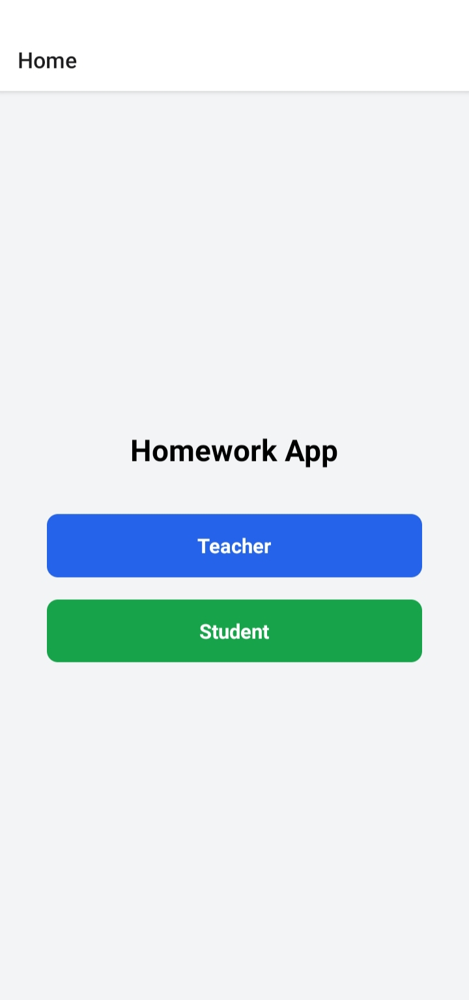
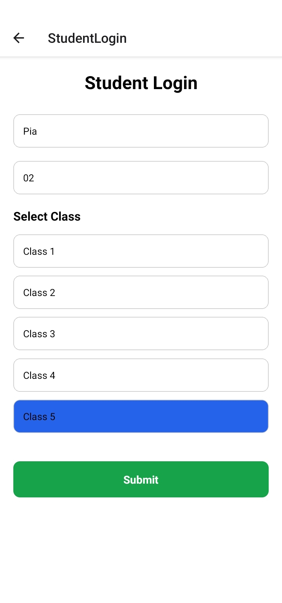
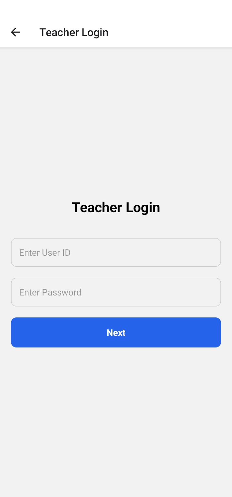
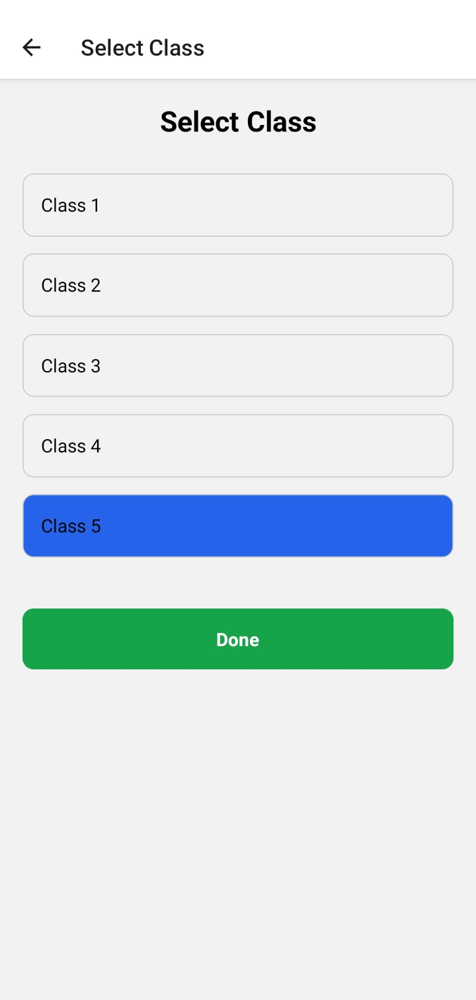
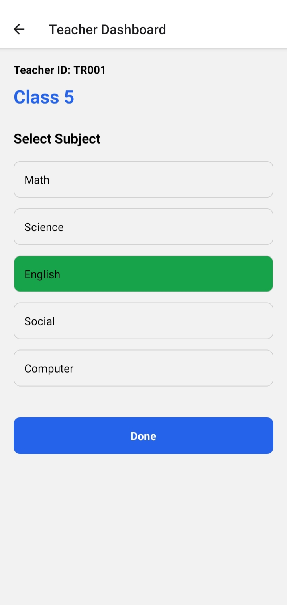
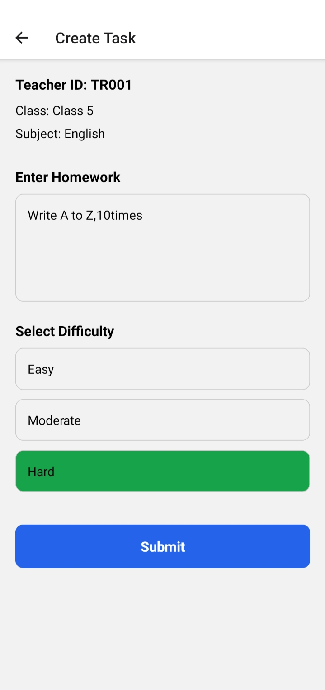

# 📱 HomeWork App

A full-stack mobile application built using React Native, Node.js, and MongoDB.

---

## 🚀 Features

- 👩‍🏫 Teacher can assign homework  
- 👨‍🎓 Student can view tasks  
- 📚 Class selection (Class 1–5)  
- 📖 Subject selection  
- ⏰ Time-based task system  
- 🔗 Live backend integration  

---

## 🛠️ Tech Stack

- React Native  
- Node.js (Express)  
- MongoDB Atlas  
- Render (Backend Deployment)  

---

## 📸 Screenshots

### 🏠 Home Screen

### 👨‍🎓 Student Login

### 📋 Student Task View

### 👩‍🏫 Teacher Login

### 🏫 Class Selection

### 📚 Subject Selection

### 📝 Task Assignment

---

## 📂 Project Structure
src/
├── screens/
├── navigation/
├── components/
├── services/
├── constants/
├── utils/

---

## 👨‍💻 Author

Hafsa Sarwath Patel